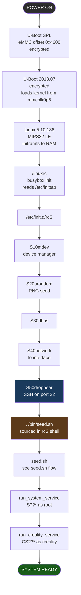
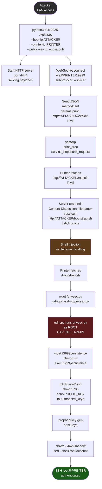
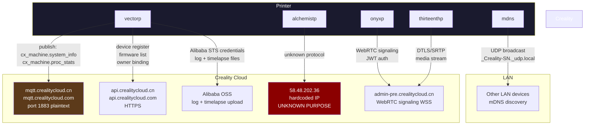
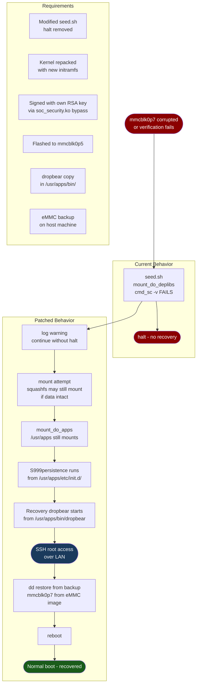

# Creality K1C 2025: Flow Diagrams

## 1. Boot Flow (POWER to READY)

---

## 2. seed.sh Execution

---

## 3. WebSocket RCE Exploit Flow

---

## 4. Print Flow (Touch to Motion)

---

## 5. Cloud Phone-Home Flow

---

## 6. Recovery Flow (Software Path)

